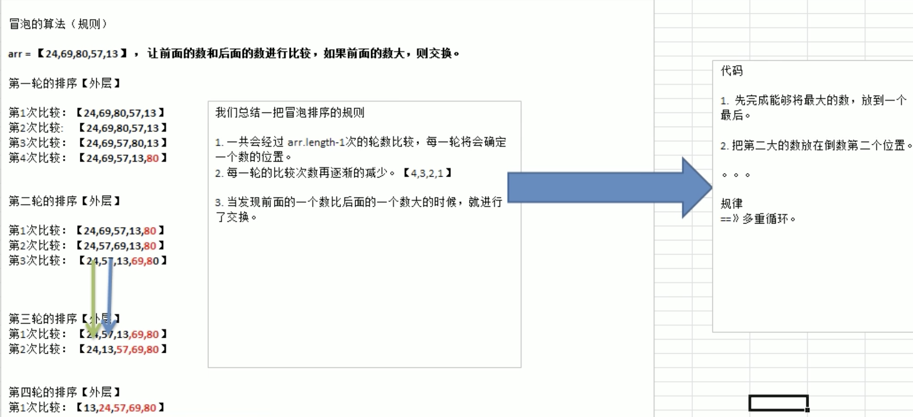

## 1. 排序介绍
排序是将一组数据，依指定的顺序进行排序的过程。

## 2.排序的分类

1).内部排序
指将需要处理的所有数据都加载到内部存储器中进行排序，包括：

- 交换式排序
    
    - 冒泡排序
    - 快速排序
    
- 选择式排序
- 插入式排序

2).外部排序
数据量过大，无法全部加载到内存中，需要借助外部存储进行排序，包括：

- 合并排序
- 直接合并排序

## 3.交换式排序
交换式排序属于内部排序法，是运用数据值比较后，依判断规则对数据位置进行交换，以达到排序的目的。包括：

- 冒泡排序（Bubble sort）
- 快速排序（Quick sort）

## 4. 冒泡排序



```angularjs
package main

import "fmt"

// 因为数组是值类型，所以需要加*
func Bubble_sort(arr *[5]int) {
	fmt.Println("排序前arr=", (*arr))
	temp := 0

	for i := 0; i < len(*arr)-1; i++ {
		for j := 0; j < len(*arr)-1-i; j++ {
			if (*arr)[j] > (*arr)[j+1] {
				temp = (*arr)[j]
				(*arr)[j] = (*arr)[j+1]
				(*arr)[j+1] = temp
			}
		}
	}
	fmt.Println("排序后arr=", (*arr))
}

func main() {
	arr := [5]int{24, 69, 80, 57, 13}
	Bubble_sort(&arr)
}

```

## 5. 二分查找

```angularjs
package main

import "fmt"

func BinaryFind(arr *[6]int, leftIndex int, rightIndex int, findVal int) {

	if leftIndex > rightIndex {
		fmt.Println("找不到")
		return
	}

	mid := (leftIndex + rightIndex) / 2
	if (*arr)[mid] > findVal {
		BinaryFind(arr, leftIndex, mid-1, findVal)
	} else if (*arr)[mid] < findVal {
		BinaryFind(arr, mid+1, rightIndex, findVal)
	} else {
		fmt.Printf("找到了，下标为%v \n", mid)
	}

}

func main() {
	arr := [6]int{24, 69, 80, 90, 200, 500}
	BinaryFind(&arr, 0, len(arr)-1, 500)
}

```